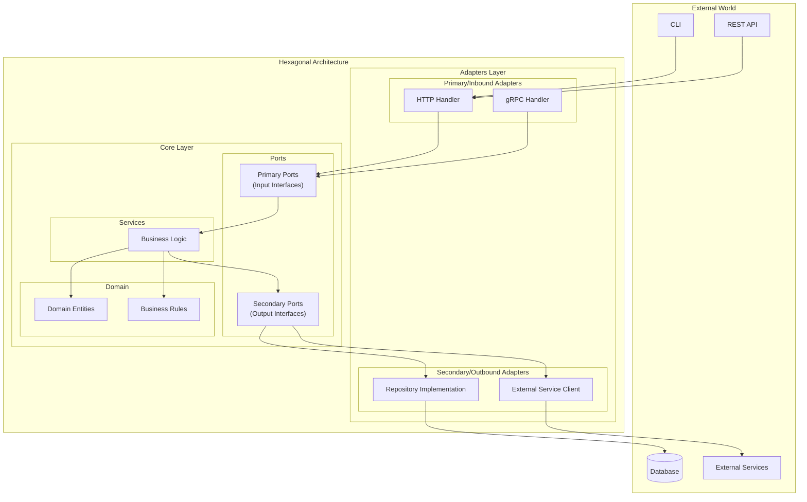
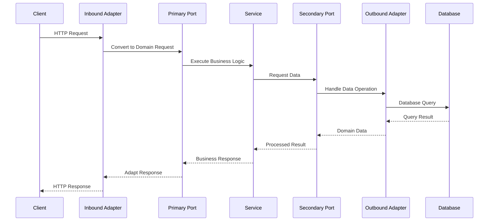

# go-hexagonal-demo

## Hexagonal Architecture Components

### Core

- services
- domain
- ports

### Services

- business logic

### Domain

- models
- rules

### Ports

- Primary Ports (Inbound)
- Secondary Ports (Outbound)

### Adapters

- Primary Adapters (Inbound)
- Secondary Adapters (Outbound)

---

# Go Hexagonal Architecture Demo Documentation

## Project Overview

This project demonstrates the implementation of Hexagonal Architecture (also known as Ports and Adapters pattern) in Go. The architecture emphasizes separation of concerns and dependency inversion, making the application more maintainable, testable, and flexible.

## Project Structure

```
go-hexagonal-demo/
├── _cmd/                  # Command-line entry points
├── internal/              # Internal application code
│   ├── core/             # Core business logic
│   │   ├── domains/      # Business entities and rules
│   │   ├── ports/        # Interface definitions
│   │   └── services/     # Business logic implementation
│   └── adapters/         # Interface adapters
│       ├── inbound/      # Input adapters (HTTP, gRPC, etc.)
│       └── outbound/     # Output adapters (Database, External Services)
├── server.go             # Main server file
├── go.mod               # Go module definition
└── go.sum               # Go dependencies checksums
```

## Architecture Flow Diagrams

### 1. High-Level Component Diagram



### 2. Request Flow Diagram



## Component Details

### 1. Core Layer

#### Domain

- Contains business entities
- Defines business rules and validation
- Pure business logic, no external dependencies

#### Ports

- **Primary (Inbound) Ports**: Define interfaces for incoming operations
- **Secondary (Outbound) Ports**: Define interfaces for external resource access

#### Services

- Implements business logic
- Orchestrates domain entities
- Uses ports for external communications

### 2. Adapters Layer

#### Inbound Adapters

- HTTP handlers
- gRPC handlers
- CLI commands
- Converts external requests to domain operations

#### Outbound Adapters

- Database repositories
- External service clients
- Implements secondary ports

## Data Flow

1. **Incoming Request Flow**:

   - External request → Inbound Adapter
   - Adapter converts request → Domain Format
   - Primary Port receives domain request
   - Service processes business logic
   - Domain entities handle business rules

2. **Outgoing Request Flow**:
   - Service requires external data
   - Secondary Port defines operation
   - Outbound Adapter implements operation
   - External system interaction
   - Response flows back through layers

## Benefits

1. **Modularity**: Clear separation of concerns
2. **Testability**: Easy to mock dependencies
3. **Flexibility**: Simple to change external implementations
4. **Maintainability**: Well-defined boundaries
5. **Independence**: Core business logic isolated from external concerns

## Getting Started

1. Clone the repository
2. Install dependencies:
   ```bash
   go mod download
   ```
3. Run the CLI:
   ```bash
   go run _cmd/main.go
   ```

## Development Guidelines

1. Keep core business logic independent of external concerns
2. Define clear interfaces in ports
3. Implement new adapters without modifying core
4. Use dependency injection for flexible component binding
5. Follow Go best practices and idioms
