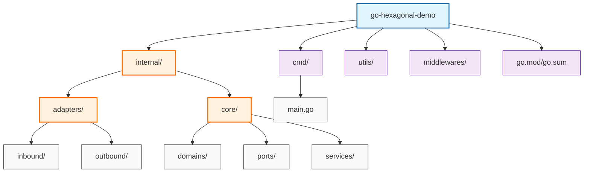
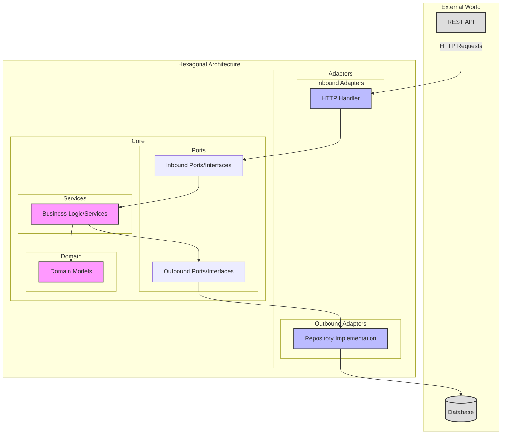

# go-hexagonal-demo

## Hexagonal Architecture Components

### Core

- services
- domain
- ports

### Services

- business logic

### Domain

- models
- rules

### Ports

- Primary Ports (Inbound)
- Secondary Ports (Outbound)

### Adapters

- Primary Adapters (Inbound)
- Secondary Adapters (Outbound)

### Create Diagram Folder Structure

### Hexagonal Architecture Diagram

